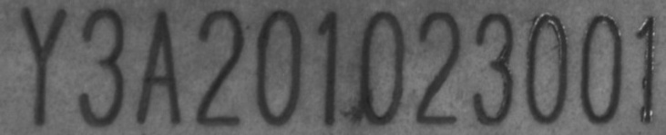

# Convolutional Recurrent Neural Network + CTCLoss 

This software implements the Convolutional Recurrent Neural Network (CRNN) in pytorch.

Origin software could be found in [crnn-pytorch](https://github.com/Holmeyoung/crnn-pytorch)

## Dependence

- Ubuntu18.04
- Python3.6.5
- torch==1.5.0
- torchvision==0.6.0
- GTX 1080 - Nvidia

## Run demo

- Download a pretrained model from [Baidu Cloud](https://pan.baidu.com/s/172pNr51QTqJRUmTl-2zsYg) (extraction code: `9wdt`)

- Run demo

  ```sh
  python demo.py -m path/to/model -i data/demo.jpg
  ```

   

  

- Expected output
  
  ```sh
  ['YY3333AA220011------00---22233---0--0011'] => ['Y3A201023001']  
  ```
  
  

## Feature

- Variable length

  It support variable length.


- Chinese support

  I change it to `binary mode` when reading the key and value, so you can use it to do Chinese OCR.


- Change CTCLoss from [warp-ctc](https://github.com/SeanNaren/warp-ctc) to [torch.nn.CTCLoss](https://pytorch.org/docs/stable/nn.html#ctcloss)

  I change the loss function to `torch.nn.CTCLoss` .

  

- Variable image_height

  At present, image_height=32, it is fixed.Now it can be set as 64 or lager.


- Bug fixed and no lmdb

  Bug has been fixed.

```

## Train your data

### Prepare data

#### Folder mode

1. Put your images in `./dataset/image_crnn` folder and organize your images in the following format:

   `label_number.jpg` 

   For example

   - English

   ```sh
   hi_0.jpg hello_1.jpg English_2.jpg English_3.jpg E n g l i s h_4.jpg...
   ```

   - Chinese

   ```sh
   一身转战_0.jpg 三千里_1.jpg 一剑曾当百万师_2.jpg 一剑曾当百万师_3.jpg 一 剑 曾 当 百 万 师_3.jpg ...
   ```

   So you can see, the number is used to distinguish the same label.


2. Run the `make_list.py` in `tool` folder by

   ```sh
   python tool/make_list.py
   ```

   It will be create `train.txt` and `eval.txt` in `dataset` folder.

3. The advantage of the folder mode is that it's convenient! But due to some illegal character can't be in the path

   

   So the disadvantage of the folder mode is that it's labels are limited. 


### Change config.py

- Change parameters

  Your can see the `config.py` in detail.


### Train

Run `train.py` by

```sh
python train.py
```
